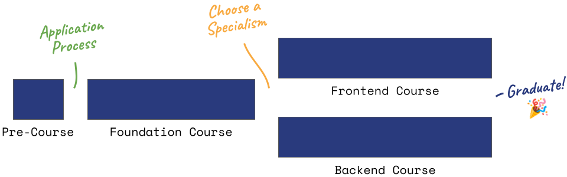

# The HackYourFuture Denmark Program

When you sign up for HackYourFuture (HYF) Denmark, you have the opportunity to join our 8 month program. It is split into two parts: a foundation course and a specialism course. In Foundation, you get a chance to practice the fundamentals of web development before you get the chance to specialise down a specific path to suit your skills and interests in the world of tech.

This repository contains all of our courses, modules, guides and other learning resources that we use throughout our learning program.

## What does the program look like?

We provide an environment for self-directed learning of the fundamentals of web development. We are not a school, we are a learning community, supported by a network of skilled mentors from the tech industry. HackYourFuture requires 30 hours of independent study per week, of which 4 hours are on-site sessions on Sundays. You are responsible for your own learning, delivering your assignments on time and showing up to the sessions well prepared. Together, we will discover state-of-the-art tools and frameworks, industry best-practices, and experience working collaboratively in a modern development team.

### Key Themes

1. **Web Design** - Build beautiful, well formatted web pages that work responsively across all devices using HTML and CSS.
2. **Web App Development** - Build fabulous functionality across the frontend and backend using the most popular web development programming language, JavaScript.
3. **Databases** - Design databases and query data using SQL across various technologies such as SQLite, MySQL and PostgreSQL.
4. **Team Collaboration** - Collaborate on projects using Git in a modern team environment based on Agile principles and Scrum practices.
5. **Generative AI** - Level up your learning with AI, practice effective prompting techniques and build AI-powered projects.
6. **Career Training** - Develop your personal brand to showcase on GitHub, LinkedIn and your CV, along with industry specific interview training.

## Getting started

You'll find lots of content in this repo, but as a starting point head to the [Courses](./courses/README.md) page to take a look through the modules we teach.

If you are, or interested in, volunteering, check out our [Mentor Guide](https://mentor.hackyourfuture.dk/) for further guidance on becoming a successful mentor in our learning community.

## Further info and questions

Feel free to check out our website [hackyourfuture.dk](https://hackyourfuture.dk) for further information about what we do and how we can help you. If you have any questions, you can find our contact details on there, too.

## Contributing

We are open source! Every volunteer is welcome to contribute with new ideas and fixes. If you're interested in becoming a contributor, please visit [Contributing](./contributing/README.md).

_The HackYourFuture Program is subject to CC BY NC SA copyright. This means you can freely use our materials, but just make sure to give us credit for it and don't use it commercially, as it is the intellectual property of our volunteers._

_This work is licensed under a [Creative Commons Attribution 4.0 International License](http://creativecommons.org/licenses/by-nc-sa/4.0/)._
