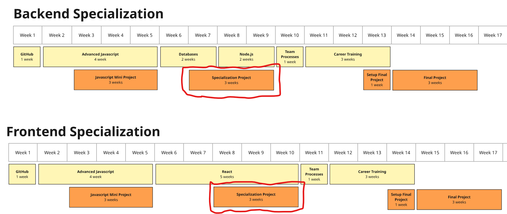

# Meal Sharing project

This proposal is to adjust the meal sharing project to fit with the new updated curriculum.

## Purpose
The purpose of the meal sharing project is to have the trainees work in larger projects that they will develop over time. This highlights the need for effective planning, code structure, and usage of the skills they have learned so far. 

It helps them practice:
- transforming requirements into functional code
- applying technical skills learned in the previous modules
- overcoming technical difficulties
- planning and time management

## Old project structure

The old meal sharing project spanned 6 weeks and was a project involving both frontend and backend development.

| Area | Module | Topic | Description |
| ---| ---| ---| --- |
| Backend |[Databases week 3](https://github.com/HackYourFuture-CPH/databases/blob/main/lesson3/README.md#homework) | DB schema & queries | Create the database schema and queries needed for the meal sharing app. Entities include **Meals**, **Reservations**, and **Reviews** |
| Backend |[Node.js week 1](https://github.com/HackYourFuture-CPH/node.js/blob/main/week1/homework/readme.md#meal-sharing-endpoints) | Simple GET endpoints | Use the project template to connect to the database. Create a few GET endpoints without any arguments which returns **Meals**. Also validate requests and return correct error codes. |
| Backend |[Node.js week 2](https://github.com/HackYourFuture-CPH/node.js/blob/main/week2/homework/readme.md#meal-sharing-endpoints) | CRUD endpoints with body | Extend the API to contain standard CRUD endpoints for **Meals** and **Reservations**.  |
| Backend |[Node.js week 3](https://github.com/HackYourFuture-CPH/node.js/blob/main/week3/homework/readme.md#meal-sharing-endpoints) | Advanced endpoints with query parameters | Extend the API to contain standard CRUD endpoints for **Reviews**. Extend **Meal** endpoint to allow for filtering and sorting |
| Frontend |[React 1 week 3](https://github.com/HackYourFuture-CPH/React/blob/main/react1/week3/homework.md#meal-sharing) | Simple overview of meals | Create a simple page with a list of all meals. Fetch the data from the backend. |
| Frontend |[React 2 week 1](https://github.com/HackYourFuture-CPH/React/blob/main/react2/week1/homework.md#meal-sharing) | Card based overview of meals | Design the overview page to use a responsive grid of cards. Start using multiple components. |
| Frontend |[React 2 week 2](https://github.com/HackYourFuture-CPH/React/blob/main/react1/week3/homework.md#meal-sharing) | Add sub pages | Add routing and add a landing page, a meal overview page, and a meal detail page. The meal details page should contain forms to reserve a meal or review it. |
| Frontend |[Meal sharing session](https://github.com/HackYourFuture-CPH/React/blob/main/react2/Meal-sharing/homework.md#meal-sharing-session) | Add searching, filtering, and sorting | Add searching, filtering, and sorting functionality to the meal overview page, a meal overview page. Show available spots for a meal. Add additional polishing. |

## New proposed structure

These are the proposed changes to make the project fit better into the new curriculum:
- **Create a project for each track**: Split the meal sharing project into two separate projects, one for backend specialization, one for frontend specialization. This will enable use to easier make changes to the projects and adjust them so they better cater to each track.
- **Call it _Specialization Project_**: Refering to the projects as _Specialization Projects_ will enable us to easily change the content of the projects without causing confusion.
- **Separate projects and modules**: Keep the description of the project separate from the individual modules. This reduces the coupling between our content thus making it easier to move or alter the content of the projects or modules. Projects and modules should be stand-alone. It also enables us to have a catalogue of projects we can choose to add to the courses as we like.
- **Keep the design open**: The initial tasks of a project can be very specific. But later tasks should keep the requirements clearly defined, but the solution open to interpretation. This will help trainees practice coming up with solutions themselves and actively consider the requirements. It can build problem solving skills and encourage creativity.
- **Shorten Projects**: My goal is to shorten the duration of the projects to 3 weeks. Each specialization will only focus on either backend or frontend. Additionally, 3 weeks fits better with the existing specializations.

## Backend Specialization Project

In this project we want to challenge the trainees in the following areas

**Database:**
- Design an Entity Relationship Diagram for a domain with a few related entities.
- Create the database schema for such diagram
- Write SQL queries to read or write data to the database

**Node.js:**
- Define endpoints following RESTful standards
- Validate inputs and handle errors
- Model, query and return data from the database
- Deployment
- Automated testing (Optional)

**What we provide:**
- A complete UI with mocked data.
    - This UI should later be connected to the real backend.
- A template project for the service which includes:
   - One sample GET endpoint
   - A connection to a postgres database
   - A guide to deploy it
   - Swagger configured to document the api
   - Unit tests setup

## Frontend Specialization Project

Focus:
* 