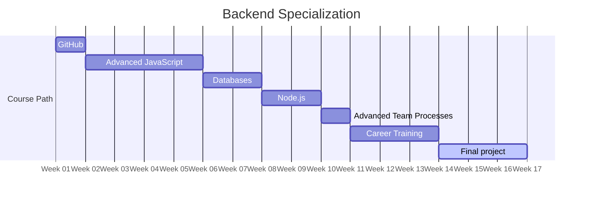

# Back-end

> [!IMPORTANT]
> Work in progress. Proposed content defined [here](https://docs.google.com/document/d/151MLm-8WA6jSk0-9JhBTuG1xZ9Fo9HRLplJx6Bhps6A/edit?tab=t.0).

## Modules
<!-- Read more here: https://mermaid.js.org/syntax/gantt.html -->

| Name                                                                           | Weeks |
| ------------------------------------------------------------------------------ | ----- |
| [Collaboration via GitHub](../../shared-modules/collaboration-via-github/)     | 1     |
| [Advanced JavaScript](./advanced-javascript/)                                  | 4     |
| [Databases](./databases/)                                                      | 2     |
| [Node.js](Node.js/)                                                            | 2     |
| [Advanced Team Processes](../../shared-modules/advanced-team-processes/)       | 1     |
| [Specialist Career Training](../../shared-modules/specialist-career-training/) | 3     |
| [Final project](./final-project/)                                              | 3     |

Current total: 16 weeks
