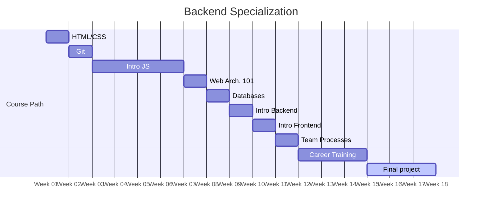

# Foundation

> [!IMPORTANT]
> Work in progress. Proposed content defined [here](https://docs.google.com/document/d/151MLm-8WA6jSk0-9JhBTuG1xZ9Fo9HRLplJx6Bhps6A/edit?tab=t.0).

## Modules
<!-- Read more here: https://mermaid.js.org/syntax/gantt.html -->

| Name                                            | Weeks |
| ----------------------------------------------- | ----- |
| [HTML & CSS](./html-and-css/)                   | 1     |
| [Git](./git)                                    | 1     |
| [Intro to JavaScript](./intro-to-javascript/)   | 4     |
| [Web Architecture 101](./web-architecture-101/) | 1     |
| [Databases](./databases/)                       | 1     |
| [Intro to Backend](./intro-to-backend/)         | 1     |
| [Intro to Frontend](./intro-to-frontend/)       | 1     |
| [Team processes](./team-processes-intro)        | 1     |
| [Career Training](./career-training/)           | 2–3   |
| [Final project](./final-project/)               | 2–3   |

Current total: 15-17 weeks
