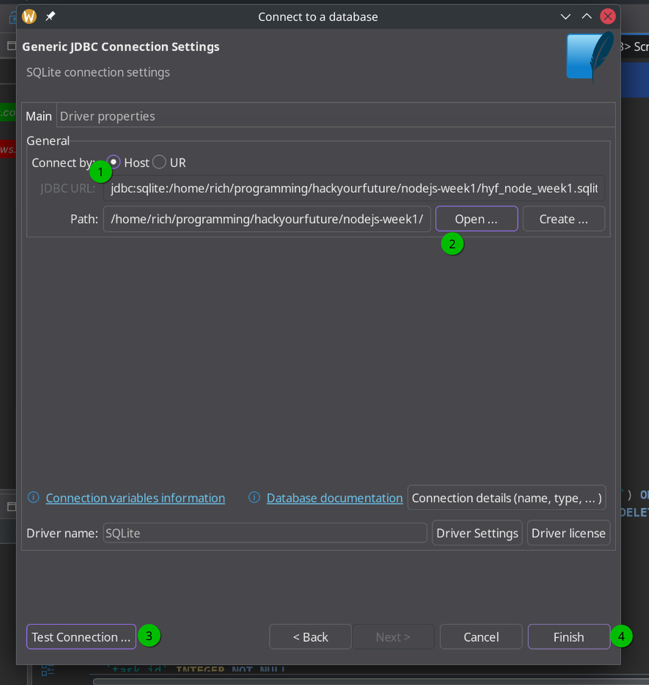

# Exercise 2

## Getting started

Webservers often want to return some information from a database. So, let's connect our webserver to a sqlite database and implement some more complex routes which return more useful information.

Open `exercise2.js` and take a read. You'll spot some new things in here, including a block which sets up `knexInstance`. Knex is a tool that makes it easy to query sql in node, so we're using it here to connect to the database.

You can see that it opens a file called `database.sqlite3`, which you'll also find in your working directory. This database has already been set up with some data.

## Viewing the database

Open the same database file in DBeaver to take a look inside.

You'll find a table called `Users`, which stores some data on user accounts for a typical web application.

### Using DBeaver

1. Open DBeaver and create a new connection, choose an SQLite database
2. For the connection settings, select the database file above, test the connection, and finish the setup.
3. If prompted to install the SQLite driver, do so.



## Schema

You'll see a `users` table with the following fields:

- `id` (primary key)
- `created_at`
- `confirmed_at` (can be `NULL`)
- `first_name`
- `last_name`
- `email` (unique)

## The task

Alright, back to the code. You can find an example of a route called `/all-users`.

Run this webserver to see it in action:

```shell
nodemon exercise2.js
```

And navigate to <http://localhost:3000/all-users> where you should see a json list of all the users in the database.

Your task is to implement a full list of routes, to practice building an API and your SQL skills. See how many you can implement!

1. `/all-users` responds with all users sorted by ID - this one is already done for you in the example!
2. `/unconfirmed-users` should respond with unconfirmed users
3. `/gmail-users` should respond with users with an @gmail.com email
4. `/2022-users` should respond with users created in 2022
5. `/user-count` should respond with the number of users
6. `/last-name-count` should respond with how many users there are with a given last name, sorted alphabetically
7. `/first-user` should respond with the first user. If there are no users in the table, respond with a 404
