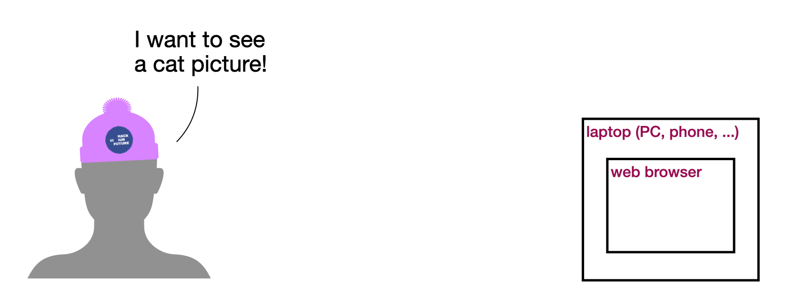

# HTTP (continued)

## How to see pictures of cats

You have your computer (laptop, phone, whatever), with a working Internet connection, and you want to see a picture of a cat. You already know the exact URL: `https://hyf.example.net/cat`. So you go to your web browser and type in the URL.

Your web browser is just software. So what does it do with what you typed in?

## Understanding URLs

Let's consider the URL `https://hyf.example.net/cat`

- The part up to the `:` is called the _scheme_: here, it's `https`. It tells the browser how to interpret the rest of the URL, and also how to actually go about fetching the resource at that URL.
- The part from `//` to the next `/` is the name of the _host_ (also known as the _server name_). Here, it's `hyf.example.net`.
- The part from that `/` onwards is called the _path_. Here, it's `/cat`.

Continue to [Finding the right server](./2-dns.md)
