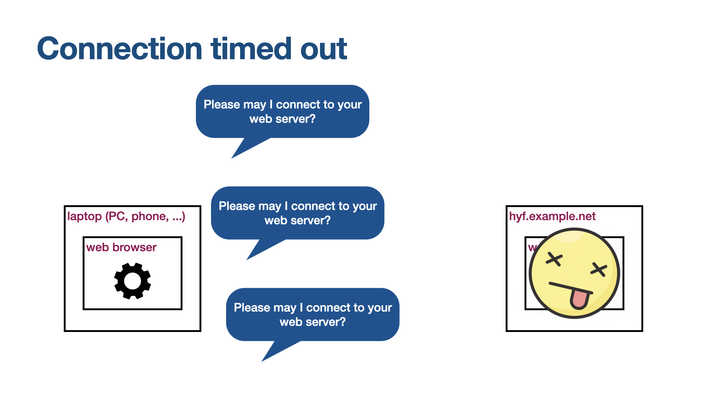
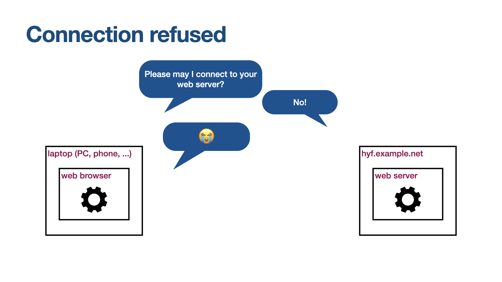
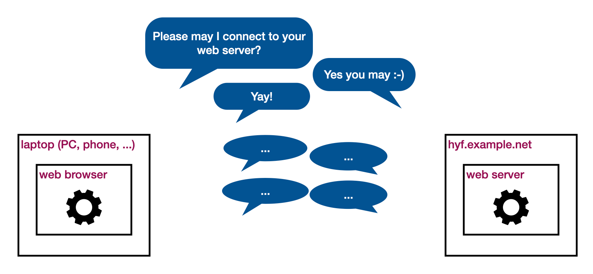

# HTTP (continued)

## Connecting

Your computer (on behalf of your web browser, on behalf of you) asks to connect to the web server:

But what if there's there's no reply?

Nobody at home. Maybe the whole server has crashed, or it's on fire, or been stolen. Maybe there isn't a server there any more. Maybe there never was.

This is called a _connection timeout_. You sometimes see this in error messages.

### Connection, Denied!

OK, what else can happen? What if the server _does_ reply? What if it says "no"?

Maybe it's not a _web_ server at all. Perhaps it's a game server, or a database server, or something like that.

Sad times: no cat picture for you.

This is a "Connection refused" error. Again, you see this in error messages sometimes.

### Connection established!

Of course, mostly we're interested in the cases where the web server _is_ there:

If this happens, then the two computers in question can now communicate over the connection:

before finally disconnecting:

The connection is just a container for two streams of data, one in each direction. So what are they saying? What's in that bit in the middle?

In the case of web servers: case: it's HTTP, that's what!

Continue to [HTTP](./4-http.md)
