# Front-end

> [!IMPORTANT]
> Work in progress. Proposed content defined [here](https://docs.google.com/document/d/151MLm-8WA6jSk0-9JhBTuG1xZ9Fo9HRLplJx6Bhps6A/edit?tab=t.0).

## Modules

| Name                                                                            | Weeks |
| ------------------------------------------------------------------------------- | ----- |
| [Collaboration via GitHub](../../shared-modules/collaboration-via-github/)      | 1     |
| [Advanced JavaScript](./advanced-javascript/)                                   | 4     |
| [React](./react/)                                                               | 5     |
| [Advanced Team Processes](../../shared-modules/advanced-team-processes/)        | 1     |
| [Specialist Career Training)](../../shared-modules/specialist-career-training/) | 3     |
| [Final project](./final-project/)                                               | 3     |

Current total: 17 weeks

```mermaid
gantt
    title Module Timeline (Weeks 1–20)
    dateFormat  YYYY-MM-DD
    axisFormat  Week %U

    section Modules
    Module A     :a1, 2025-09-01, 4w
    Module B     :a2, after a1, 6w
    Module C     :a3, 2025-10-15, 3w
    Module D     :a4, 2025-11-05, 5w
```

