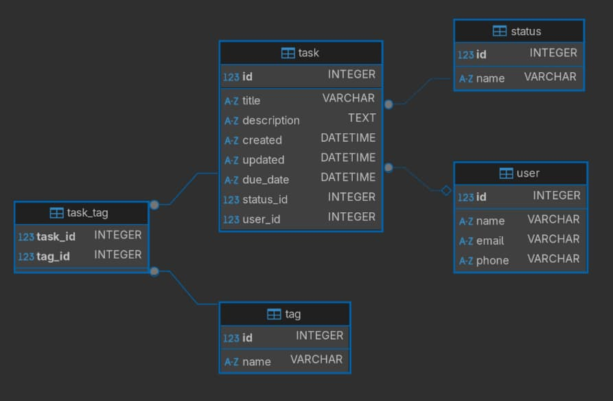

# Session Plan

## Session Materials

- [Database Diagram](assets/database-diagram.jpg) - The diagram of the database to be created in this session
- [Sample Tasks database](assets/tasks.sqlite3) - Pre-created SQLite database with the contents of [this SQL file](assets/session-data.sql)

## Session Outline

1. [Introduction to Databases](#what-is-a-database)
   - Briefly explain what a database is and why we use them.
   - Discuss the importance of databases in modern applications.

2. [Creating Your First Database](#creating-your-first-database)
   - Guide trainees through creating a new database.
   - Execute the provided SQL file to create tables and insert sample data.
   - Ensure everyone has the same starting point.
   - Introduce key terms: table, row, column, primary key, foreign key.

3. [Interacting with your database](#interacting-with-your-database)
   - Demonstrate basic SQL commands: SELECT, INSERT, UPDATE, DELETE.
   - Show examples of filtering and sorting data using WHERE, ORDER BY, and LIMIT clauses.
   - Encourage trainees to follow along and execute commands on their own databases.

## What is a database?

A database is an organized collection of structured information, or data, typically stored electronically in a computer system. Think of it as a digital filing cabinet where you can store, retrieve, and manage information efficiently.

### Real-Life Examples

#### 1. Personal Use

- **Contact List**: Your phone's contact list is a simple database storing names, phone numbers, and email addresses
- **Photo Library**: Your phone's photo app is a database organizing images by date, location, or album
- **Excel Spreadsheets**: When you track your monthly expenses or create a shopping list, you're essentially using a simple database

#### 2. Business Use

- **Inventory Management**: Stores use databases to track products, their quantities, and prices
- **Customer Records**: Businesses maintain databases of customer information, purchase history, and preferences
- **Employee Management**: Companies store employee details, attendance, and payroll information

#### 3. Everyday Services

- **Banking Systems**: Your bank uses databases to track your account balance, transactions, and personal information
- **Social Media**: Platforms like Facebook or Instagram store user profiles, posts, and connections
- **Online Shopping**: E-commerce sites use databases to manage product catalogs, customer orders, and shipping information

### What do we gain from using a database?

1. **Organization**: Databases help keep information structured and easy to find
2. **Efficiency**: They allow quick access to specific pieces of information
3. **Data Integrity**: They help maintain accurate and consistent data
4. **Security**: They provide controlled access to sensitive information
5. **Scalability**: They can handle growing amounts of data efficiently
6. **Reliability**: Data is protected from loss or corruption
7. **Shareability**: Multiple users can access the same data

Think of a database as a well-organized digital library where you can store and retrieve information quickly and efficiently, just like how you might use a filing cabinet or spreadsheet, but with more power and flexibility.

### Databases in Software Architecture

In modern software applications, databases serve as the backbone of data storage and management. Let's look at some common examples:

- Imagine a recipe website where users can share their favorite dishes. The database stores all the recipes, user profiles, comments, and ratings. When someone searches for "chocolate cake," the website queries the database to find all relevant recipes.
- A movie streaming platform uses databases to store information about movies, user watchlists, and viewing history. When you log in, the system retrieves your preferences and watch history from the database to recommend new movies.
- Even a simple blog needs a database to store articles, comments, and user information. Without a database, these applications would be like a library without a catalog system - you might have all the information, but finding and managing it would be extremely difficult.

## Database vs Database Management System

### Real-Life Example - Online Store

Imagine you're running an online store. You need to maintain such data entries like:

- inventory
- orders
- customer information
- and many more.

Now, a customer X makes an order. To process the order, you must update the inventory, check the customer data, update the order status at each way of the process, add order to customer information etc. Seems like a lot of work, doesn't it?

What if that work could be automated and better, validated on the go, so all of the records match each other? This is where **DBMS** comes into the scene!

1. **Without DBMS**: You'd need to manually update spreadsheets for inventory, orders, and customer information
2. **With DBMS**:
   - When someone places an order, the system automatically:
     - Updates inventory
     - Creates an order record
     - Sends confirmation emails
     - Updates customer history
   - All of this happens instantly and accurately

Think of a DBMS as your digital assistant that helps you manage your data efficiently, securely, and reliably, just like how a librarian helps manage a library's collection of books.

### Popular DBMS Options

#### 1. [MySQL](https://www.mysql.com/)

- **Often used for**: Web applications, small to medium businesses
- **Why**: Free, reliable, and widely supported
- **Example**: Many WordPress websites use MySQL to store their content

#### 2. [PostgreSQL](https://www.postgresql.org/)

- **Often used for**: Complex applications, large datasets
- **Why**: Powerful features, great for complex queries
- **Example**: Instagram uses PostgreSQL to store user data and photos

#### 3. [MongoDB](https://www.mongodb.com/)

- **Often used for**: Applications with changing data structures
- **Why**: Flexible, can handle different types of data easily
- **Example**: Many mobile apps use MongoDB for its flexibility

#### 4. [SQLite](https://sqlite.org/)

- **Often used for**: Small applications, mobile apps
- **Why**: Lightweight, no setup required
- **Example**: Many mobile apps use SQLite for local storage

## Creating Your First Database

The next step is creating a database to have a playground for learning SQL. Also it will help us explore the concepts of tables, rows, columns, primary keys, and foreign keys.

### Step 1: Create a New SQLite Connection

1. Click the **"New Database Connection"** button (plug icon) in the toolbar or `Ctrl+Shift+N`
2. Select **SQLite** from the list of databases
3. Click **Next**
4. In the **Path** field, click **Browse** and choose where to save your database file
5. Name your database file: `tasks.sqlite3`
6. Click **Test Connection** to verify everything works
7. Click **Finish**

You can find more information in the [DBeaver documentation for Sqlite](https://dbeaver.com/docs/dbeaver/Database-driver-SQLite/).

### Step 2: Understanding Database Structure

So we just created our database. Before we create tables, let's understand the key concepts:

#### Database Terminology

- **Database**: The entire collection of related data (like a filing cabinet)
- **Table**: A collection of related records (like a folder in the filing cabinet)
- **Row (Record)**: A single entry in a table (like one document in a folder)
- **Column (Field)**: A specific piece of information in each row (like name, date, etc.)
- **Primary Key**: A unique identifier for each row
- **Foreign Key**: A reference to a primary key in another table

### Step 3: Create Tables and Insert Sample Data

1. On the [Session materials](#session-materials) you can find a sample SQL file. Copy the contents of this file.
2. In DBeaver, right-click on your database connection → **SQL Editor** → **Open SQL Script**
3. Paste the copied SQL commands into the editor
4. Click the **Execute SQL Script** button or press `Alt+X`. This will execute the whole script.

### Step 4: Explore Your Database

After executing the SQL file, you should see a database like the diagram this one.



#### Exercise 1

1. Follow the above steps if you haven't already.
2. **Explore your database** in DBeaver:
   1. What kind of **tables** can you find?
   2. Can you find how to see a **diagram** for your database?
   3. Select the `task` table. What kind of **properties** does it have?
   4. What kind of **data** is there? Can you explore the data in DBeaver?
   5. What is the `title` value in the row 18?

## Data types

Open the **properties** tab of `task` table again. What are these INTEGER, TEXT, DATETIME, etc?

When creating tables, we define the type of data each column will hold. This helps the database understand how to store and manage the data efficiently.

| Data Type | Description       | Usage                           |
| --------- | ----------------- | ------------------------------- |
| INTEGER   | Whole numbers     | For IDs, counts, ages           |
| REAL      | Decimal numbers   | For prices, measurements        |
| TEXT      | Text strings      | For names, descriptions, emails |
| BOOLEAN   | True/False values | For flags, status indicators    |
| DATE      | Date values       | For dates                       |
| TIME      | Time values       | For time                        |
| DATETIME  | Date and time     | For timestamps                  |
| BLOB      | Binary data       | For images, files               |

> [!NOTE] No need to remember all of these
> Keep in mind, you can alway refer back to [cheatsheets](https://www.w3schools.com/sql/sql_datatypes.asp) or use any [documentation](https://www.sqlite.org/datatype3.html) when in doubt!

## Interacting with your database

Now that we have our database set up with tables and sample data, let's learn how to interact with it using **SQL (Structured Query Language).**

### What is SQL?

**SQL** (**S**tructured **Q**uery **L**anguage) is a specialized programming language designed for managing and manipulating data in relational database management systems. Unlike general-purpose programming languages such as JavaScript or Python, SQL is specifically focused on data operations.

Key Characteristics:

- **Declarative Language**: You describe what data you want, not how to get it
- **Standardized**: While different database systems may have variations, the core SQL commands are standardized
- **Powerful**: Complex data operations can often be performed with just a few lines of code
- **Used Everywhere**: From small mobile apps to large enterprise systems, SQL is the backbone of data management

4 main operations:

1. **SELECT**: Reading data from the database
2. **INSERT**: Adding new data to the database
3. **UPDATE**: Modifying existing data
4. **DELETE**: Removing data from the database

These four operations (collectively known as **CRUD** - Create, Read, Update, Delete) form the foundation of almost all database interactions.

Let's explore each of these operations in detail.

### SELECT - Retrieving Data

The SELECT statement is used to retrieve data from one or more tables. This is the most common SQL operation.

Basic Syntax:

```sql
SELECT column1, column2, ... FROM table_name;
```

Examples:

```sql
-- Retrieve all columns from the user table
SELECT * FROM user;

-- Retrieve only specific columns
SELECT name, email FROM user;

-- Retrieve data with a limit
SELECT * FROM user LIMIT 3;
```

### WHERE - Filtering Data

The WHERE clause is used to filter records based on specific conditions.

Basic Syntax:

```sql
SELECT column1, column2, ... FROM table_name WHERE condition;
```

Examples:

```sql
-- Find users with a specific name
SELECT * FROM user WHERE name = 'John Smith';

-- Find tasks with a certain status
SELECT * FROM task WHERE status = 'In Progress';

-- Find tasks created after a specific date
SELECT * FROM task WHERE created > '2023-01-01';
```

### ORDER BY - Sorting Data

The ORDER BY clause is used to sort the results in ascending or descending order.

Basic Syntax:

```sql
SELECT column1, column2, ... FROM table_name ORDER BY column1 [ASC|DESC];
```

Examples:

```sql
-- Sort users alphabetically by name
SELECT * FROM user ORDER BY name;

-- Sort tasks by creation date (newest first)
SELECT * FROM task ORDER BY created DESC;

-- Sort tasks by status and then by title
SELECT * FROM task ORDER BY status_id, title;
```

#### Exercise 2

Now that your database is set up, you're ready to practice SQL queries. Below are some exercises to help you get started.

1. List the names and phones of all of the users.
2. List all of the users, ordering them by name alphabetically.
3. Find the name of the user of id 10.
4. Find 3 oldest (by create date) tasks.

> [!NOTE] Interested in more options?
> Refer back to [intro to sql cheatsheet](../pre-read/intro-sql.md) and practice some more complex queries!

### INSERT - Adding Data

The INSERT statement is used to add new records to a table.

Basic Syntax:

```sql
INSERT INTO table_name (column1, column2, ...) VALUES (value1, value2, ...);
```

Examples:

```sql
-- Add a new user
INSERT INTO user (name, email, phone) VALUES ('Jane Doe', 'jane@example.com', '555-1234');

-- Add a new task
INSERT INTO task (title, description, created, updated, status_id, user_id)
VALUES ('Learn SQL', 'Practice basic SQL operations', DATETIME('now'), DATETIME('now'), 1, 1);
```

### UPDATE - Modifying Data

The UPDATE statement is used to modify existing records in a table.

Basic Syntax:

```sql
UPDATE table_name SET column1 = value1, column2 = value2, ... WHERE condition;
```

> [!IMPORTANT]
> ⚠️ Always include a WHERE clause with UPDATE statements. You don't want to update all records by mistake! 😵

Examples:

```sql
-- Update a user's email
UPDATE user SET email = 'new.email@example.com' WHERE id = 1;

-- Mark a task as completed
UPDATE task SET status_id = 3 WHERE id = 3;

-- Update multiple fields at once
UPDATE task SET title = 'New Title', description = 'New Description' WHERE id = 5;
```

### DELETE - Removing Data

The DELETE statement is used to remove records from a table.

Basic Syntax:

```sql
DELETE FROM table_name WHERE condition;
```

> [!IMPORTANT]
> ⚠️ Same warning as with UPDATE. Don't forget your WHERE clause.

Examples:

```sql
-- Delete a specific user
DELETE FROM user WHERE id = 10;

-- Delete completed tasks
DELETE FROM task WHERE status_id = 3;
```

### Interactive Practice

Now, let's practice these operations together:

1. Run the following query to see all tasks:

   ```sql
   SELECT * FROM task;
   ```

2. Add a new task:

   ```sql
   INSERT INTO task (title, description, created, updated, due_date, status_id, user_id)
   VALUES ('Prepare presentation', 'Create slides for the team meeting', DATETIME('now'), DATETIME('now'), null, 2, 1);
   ```

3. Verify the task was added:

   ```sql
   SELECT * FROM task ORDER BY id DESC LIMIT 1;
   ```

4. Update the task status:

   ```sql
   UPDATE task SET status_id = 2 WHERE title = 'Prepare presentation';
   ```

5. Check that the update worked:

   ```sql
   SELECT * FROM task WHERE title = 'Prepare presentation';
   ```

#### Exercise 3

Combine all the queries you learned!

1. Add yourself as a new user in the `user` table
2. Create 2 or more tasks assigned to yourself
3. Update the task you just created to change its status to "In Progress" (status_id = 2)
4. Retrieve only the title and description of all tasks assigned to you
5. Delete a task that you no longer need
