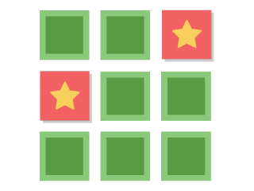

# Project Brief - Memory Game

You joined an online game platform startup and your task is to build a game that people can play in their browser.

It will be based on the classic Memory Game, where a player needs to flip all the cards in a grid until they find all the matching pairs. You aspire to make the game smooth and pleasant, so they have fun and keep playing it.

> [!NOTE]
> Take some time to research online for similar games and how they look and work to gain inspiration. This is an important skill to practice because you won't always know (or be told) how to approach a new task.

## Requirements

Here are the features and details of the the app that need to be implemented. They have been listed in an order that might be useful to follow, but feel free to tackle the steps in the order that you see best fit.

You are strongly encouraged to add your own features, details, design and flare throughout the steps, as long as these requirements are still met.

### Week 1 Milestone

#### The Flippable Card

You are provided with a card picture and a card backside image which you can use, [which you can find here](./assets/card/), or feel free to choose your own.

Your app needs to:

- [ ] Display a card
- [ ] Flip the card on click, showing the backside pattern to the picture and vice versa.
- [ ] Animate the flip

It can look and be animated in any way you like, but here's some inspiration:

#### The Card Grid

Next, you need to set up the cards in a grid, so they are displayed in a way suitable for the game to be played. You'll need some more pictures now!

- [ ] Display a grid of unique pairs of cards in a random order
- [ ] It should be at least 3x3, but a bigger grid is up to you

Tips:

1. You'll want to use an object to store the card details, such as an id, name, picture and more.
2. You'll need to store multiple of these objects, and then traverse through them to display them in a grid.
3. Each unique card will need to appear twice in the grid in a random order - think about _doubling_ and _shuffling_ your array to achieve this.
4. Make sure all the cards are still flippable and animate as you implemented in the first step!

Here's some inspiration:

#### Counters and Timers

Now you need to add some of the core game functionality:

- [ ] Display a counter that shows how many times the player has _revealed_ a card.
- [ ] Display a timer should start from when the player clicks their first card.
- [ ] Once two cards are flipped, they should stay flipped for X seconds, after of which they flip back down automatically.

Tips:

1. Revealing a card is not the same as a click! Your counter should incrememt with reveals.

### Week 2 Milestone

#### Storing and Retrieving Your Cards

Up until now, your cards have been hardcoded in your app code. Instead, these should be stored in a database and fetched via an API which the frontend can use to retrieve and display them.

- [ ] Design a database schema that can store your cards
- [ ] Create your database and add some cards
- [ ] Implement a route in your backend that returns all of the cards from the database
- [ ] Refactor your frontend code to fetch the cards via your new API, and replace your hardcoded cards

Tips:

1. After these changes, your game should appear to the player to function just as it did before.
2. Refer to your exercises from previous modules if you need a reminder on creating databases and APIs.

#### The Game Logic

The final step is to add the game logic, so it becomes a playable game!

- [ ] Only two cards should be able to be flipped at a time
- [ ] If the cards match, they should disappear
- [ ] Once all cards have disappeared, the player wins and the game is over
- [ ] After winning, the player should be able to restart the game and play again

### Week 3 Milestone - Your own ideas!

Now your game is working, it's time to introduce your own features! Think of some improvements or changes to the game and implement it.

You should choose 3 features/improvements as a minimum to showcase as part of your project. But, you are welcome to add more and further polish your app to a high standard until you are super proud of it!

Some ideas for inspiration:

- [ ] Make use of the counter or timer in some way to make the game more challenging
- [ ] Add multiple levels so the player doesn't get bored
- [ ] Add more animations and interactivity, to make it exciting
- [ ] Implement a score mechanic
- [ ] Keep track of your personal best score/time
- [ ] Implement some options that the user can tweak, such as grid size
- [ ] Let the player choose a name, and save their score in the database
- [ ] Implement a leaderboard for the top 10 scores
- [ ] ... and many more!
