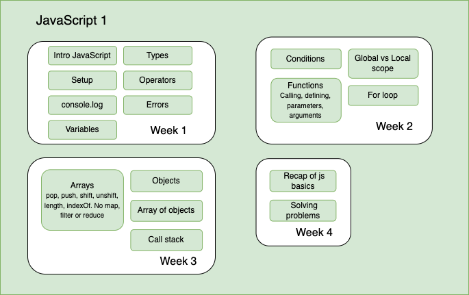
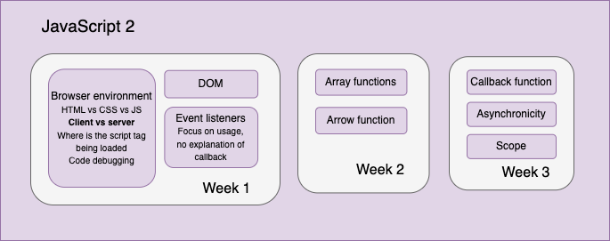
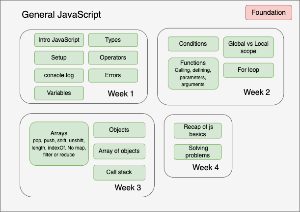
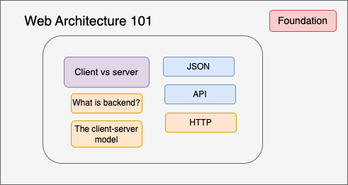
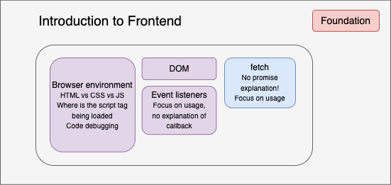
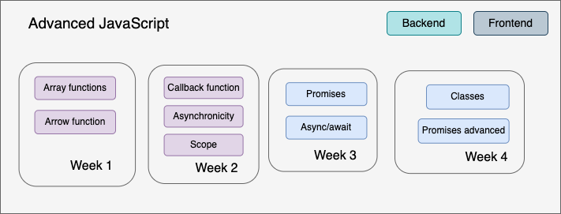
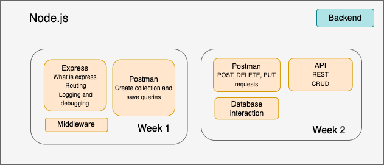

## 📘 JavaScript & Node.js Module Restructuring Plan Proposal

### 🎯 Goal

To restructure existing JavaScript and Node.js content into a new modular curriculum across three tracks: **Foundation**, **Frontend Specialism**, and **Backend Specialism**. The focus is on reuse, clarity, and separating concerns between frontend and backend education.

This is schemas for current module structures. I will use the same **color-coding** for the parts of new modules, so it would be obvious where is this topic is coming from. You can also use the attached file to have interactive schemas in [draw.io ](https://app.diagrams.net/)

Here's the [draw.io source file](./js-node-plan.drawio) for the diagrams in this document.

---

## 🧱 FOUNDATION COURSE STRUCTURE

### 🎓 Final Project Strategy

**Vision:** Trainees begin shaping their Foundation course **final project**, gradually building upon it across modules. By the end, they should have:

- A frontend consuming data from a backend API
- Core business logic reused from early JavaScript work.

**Approach:**

- Start developing simple reusable logic (just functions solving problems for their future project!) in latest General JavaScript homeworks.
- Reuse and expand this logic in homeworks for Introduction modules.

### 1. Module: General JavaScript

**Duration**: 4 weeks\
**Source**: copy of JavaScript 1\
**Purpose**: Establish fundamental JavaScript knowledge. Teaches only one way to solve problems, no advanced topics or multiple approaches.

#### Topics:

- **Week 1**: Intro JS, Types, Setup, Operators, console.log, Errors, Variables
- **Week 2**: Conditions, Functions, Scope, For loop
- **Week 3**: Arrays (no map/filter/reduce), Objects, Call stack
- **Week 4**: Recap and Problem Solving

#### Final Week Homework Note:

Introduce small reusable logic/function tasks already in the final week (e.g., calculating prices, transforming arrays) and encourage saving the code — these will be reused in API or frontend in later modules.

### 2. Module: Web Architecture 101

**Duration**: 1 week\
**Purpose**: Introduce shared concepts between frontend and backend. Creates a unified mental model before Introductions for specialisations and removes duplicates from modules (like API explanations).\
**Note**: It, probably, will require some new material there (we didn’t have architecture before), but we can always just stick to the topics that was introduced before in old modules.

#### Topics [not limited to]:

- Client vs Server
- What is Backend?
- Client–Server Model
- HTTP
- JSON
- API
- Databases
- Conceptual overview of deployment (to prepare for real-world usage in final project)

### 3. Module: Introduction to Backend

**Duration**: 1 week\
**Purpose**: Provide a hands-on primer to backend development. Enables learners to build a basic working backend (simple CRUD server or even less).\
**Reasoning**: Placing backend first in hands-on development allows learners to apply their JavaScript fundamentals while reinforcing their understanding of APIs introduced in Web Architecture 101. This progression is both natural and confidence-building: learners already know how to write logic, and now they can wrap it in endpoints (basically, another level of functions). Starting here also clarifies the API before they consume it from the frontend side.

#### Topics:

- Intro to Node.js
- Simple web server
- Using Postman to test endpoints
- CRUD implementation (focus on code, not theory)
- _Optional_: Basic DB interaction (since we have a module, but not necessary)
- Optional: Introduce a simple one-click deployment path

### 4. Module: Introduction to Frontend

**Duration**: 1 week\
**Purpose**: Demonstrate how JavaScript is used on the frontend, how to interact with DOM and how to interact with APIs from the browser.

#### Topics:

- Browser environment (HTML vs CSS vs JS, script tag placement, debugging)
- DOM manipulation basics
- Event listeners (focus on usage, no callback explanation)
- `fetch()` for calling APIs (usage only — promises explained later)
- _Optional_: Introduce a simple one-click deployment path

### Open Questions:

- **Deployment**: Should we provide guided deployment in Introduction modules? Just instructions, so they would be able to use them for Foundation Final Project.

---

## 🧱 SPECIALISATIONS COURSE STRUCTURE

## Frontend & Backend Specialisations

### 1. Module: Advanced JavaScript

**Duration**: 4 weeks\
**Purpose**: Deepen JavaScript knowledge with modern concepts and patterns used in both frontend and backend development. This module is part of both the Frontend and Backend Specialisation tracks. While topics are shared, examples and homeworks must be tailored per track.

#### Topics:

- **Week 1**: Array functions, Arrow functions
- **Week 2**: Callback functions, Asynchronicity, Scope
- **Week 3**: Promises, Async/Await
- **Week 4**: Classes, Advanced Promises

#### Track-specific differentiation:

- **Frontend Specialism**: Browser-based examples (e.g., DOM tasks, UI-based async data fetching)
- **Backend Specialism**: Server-based examples (e.g., file handling, API response management)

#### To do:

- Rethink the final assignment structure and integration with broader project.

---

### Backend Specialisation

### 1. Module: Node.js

**Duration**: 2 weeks\
**Purpose**: Expand learners’ backend development capabilities using Node.js and Express. Builds on Introduction to Backend with more advanced tooling, patterns, and responsibilities.

#### Topics:

- **Week 1**:
  - Express (intro, routing, logging, debugging)
  - Middleware
  - Postman (creating collections, saving queries)
- **Week 2**:
  - Postman (POST, DELETE, PUT requests)
  - API Design (REST, CRUD)
  - Database interaction (expanded)

**Optional changes:**

- Can optionally have an additional week to include advanced backend topics that was proposed in previous dicussions

#### To do:

- Rethink the final assignment structure and integration with broader project.

---

## Other Questions

> Should we introduce js module/import/export concept in foundation or not?

_Option 1_: It might be natural to introduce separate files in «Introduction to Backend», and then mention in «Introduction to Frontend» how it is solved there.

_Option 2_: Introduce idea of structuring files (and import/export) on «Web Architecture 101» session.

_Option 3_: Not to give this concept in Foundation, because it seems like it can be done in one file, and later they will have to have separate files in React / Node anyway.
